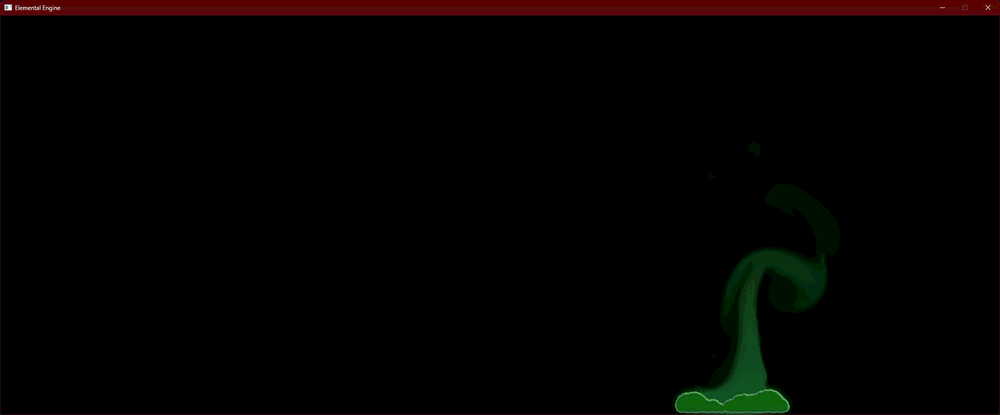

# Elemental Engine

> This project is my most ambitious project until now.
>
> The core idea is to have an engine to render different elements and their interaction
>
> Target: This engine must be finished around the time I finish my PhD.

A real-time **Multi-Element Reactivity Engine** built from scratch in modern C++ to simulate

- gas behavior
- Liquid behavior
- Electricity
- Thermodynamics (fire and explosion)

and their interaction.

I will be writing the engine without any use of game engines. My focus is right now on Vulkan backend.
However I am trying to write an abstraction layer to make it possible to add DX12 and even Metal at some point. But that is for the future...

## Core Architecture & Pipeline Layout

I will be using two backends

- **Vulkan 1.3 Backend (Main Focus)**
- **DirectX 12 Backend (Paused)**

### Used Hardware

**Development Device:** Intel Core CPU / NVIDIA RTX 4070 Ti Super / Windows 11

## Simulation Framework

- Stam's Stable fluid (Poison Gas)
- Clevet Particle-based Viscoelastic Fluid Simulation (Acidic Slime)
- Macklin Position Based Fluids (An experimental case was developed at first for acidic bath but It wasn't the way I liked it. I save it for the Future updates but for water.)
- Electricity using midpoint displacement
- For the electricity I started first by trying space colonization algorithm. Which was too slow. I then moved to midpoint displacement.
- Thermodynamics

## Dependencies

I used VMA (Vulkan Memory Allocator) for memory allocations. You can find it [here](https://github.com/GPUOpen-LibrariesAndSDKs/VulkanMemoryAllocator) and install it.

## Moving Forward

The following is how I would like to move forward with the project

- [x] Set up windowing (GLFW/SDL), swapchains, and device initialization for both Vulkan 1.3 and DX12.
- [x] Build the thin HAL. Get a basic triangle rendering in both APIs to verify the pipeline.
- [x] Implement Compute Shader dispatching in the HAL. Set up structured buffers and read/write textures.
- [x] Write a basic advection and diffusion compute shader to move generic "density" around.
- [x] Fluid Dynamics (Poison Gas)
- DX12 development is paused here.
- [x] Collision Geometry (Dirichlet boundary condition)
- [x] Added Acidic Slime using Clavet algorithm
- [x] phase change compute pass
- [x] Add lightning strike (electricity)
- [x] Add interactivity between lightning strike and slime
- [x] Ingnition logic when lightning strikes the slime
- [x] Rendering fire when the slime burns
- [x] Camera
- [x] Moving towards 3D (stencil and depth buffers)
- [ ] 3D Clavet and slime physics
- [ ] Moving other elements to 3D
- [ ] Post-processing
- [ ] Optimization

## 2D concepts

The math is finished and there is a proof of concept for 2D.

  

    
  

