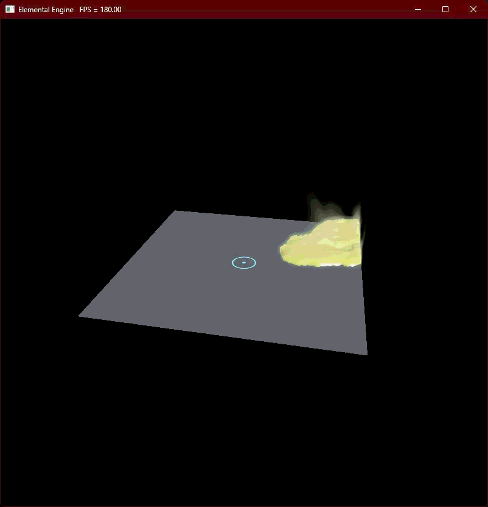

# Elemental Engine

A real-time, compute-driven **Multi-Physics & Reactivity Engine** built from scratch in C++20 and **Vulkan 1.3**, featuring coupled multi-element interactions (gas, viscoelastic fluids, electricity, thermodynamics) and a custom Render Hardware Interface (RHI).

> version 1.0.0

## Showcase

<div style="display: flex; gap: 100px; align-items: flex-start;">

  <div>
    
  </div>

</div>

## Technical Highlights

- **Custom Low-Level RHI:** Thin hardware abstraction designed around modern explicit graphics APIs (Vulkan 1.3 native, DX12-ready architecture).
- **Modern Vulkan 1.3 Core:**
  - Full **Dynamic Rendering** pipeline (`VK_KHR_dynamic_rendering`), removing legacy render pass boilerplate.
  - Utilization of compute shaders.
  - Integrated **Vulkan Memory Allocator (VMA)** for memory management.
  - Vertex Pulling is used instead of Vertex Buffers.
- **Hierarchical GPU Profiling:** Instrumented with `VK_EXT_debug_utils` for nested event hierarchy in RenderDoc and Nsight.

## Performance & Metrics

**Benchmarked on:** NVIDIA GeForce RTX 4070 Ti Super / Intel Core CPU / 1440p

Coming up in the next updates with some optimizations.

## Dependencies

I used VMA (Vulkan Memory Allocator) for memory allocations. You can find it [here](https://github.com/GPUOpen-LibrariesAndSDKs/VulkanMemoryAllocator) and install it.

## Building from Source

```bash
git clone https://github.com/ArminGEtemad/ElementalEngine.git
cd ElementalEngine
mkdir build && cd build
cmake ..
cmake --build . --config Release
```
