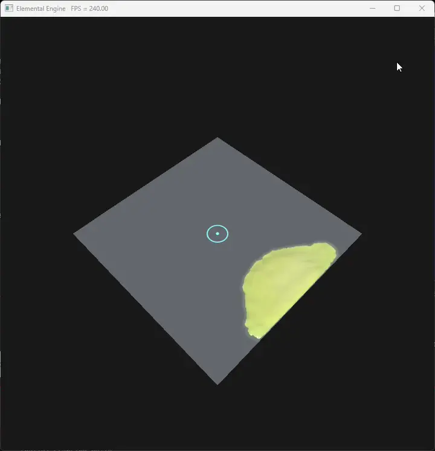

# Elemental Engine

A real-time, compute-driven **Multi-Physics & Reactivity Engine** built from scratch in C++20 and **Vulkan 1.3**, featuring coupled multi-element interactions (gas, viscoelastic fluids, electricity, thermodynamics) and a custom Render Hardware Interface (RHI).

> version 1.2.0

## Showcase

<div style="display: flex; gap: 100px; align-items: flex-start;">

  

</div>

GIFs and pictures of the older versions can be found [here](PicturesAndGifs).

## Technical Highlights

### 1. Coupled Multi-Physics Simulation (GPU Compute)

- **Viscous Fluid Dynamics (PBF):** Position-Based Fluids implementation based on Clavet et al. Particle-based Viscoelastic Fluid Simulation.
- **Eulerian Gas Simulation (Stam Stable Fluids):** 3D Navier-Stokes.
- **Procedural Dielectric Breakdown:** 3D Midpoint Displacement lightning arcs with branching.
- **Systemic Thermodynamic Coupling:** Slime acts as a dynamic continuous gas emitter; electrical arcs trigger localized thermal thresholds, initiating heat transfar and fire.

### 2. Rendering Pipelines & Volume Integration

- **Screen-Space Fluid Rendering (SSFR)**
- **Volumetric Raymarcher**
- **Vertex Pulling**

### 3. Modern Vulkan 1.3 Core & RHI

- **Low-Overhead Custom RHI:** Backend-agnostic hardware abstraction layer architected for explicit APIs (Native Vulkan 1.3; extensible to DX12).
- **Dynamic Rendering:** No legacy render pass/framebuffer boilerplate.
- **Memory Management:** Integrated Vulkan Memory Allocator (VMA).
- **Diagnostic Instrumentation:** Debug labeling via `VK_EXT_debug_utils` for deep Nsight Graphics and RenderDoc frame analysis.

## Performance & Metrics

**Benchmarked on:** NVIDIA GeForce RTX 4070 Ti Super / Intel Core CPU i7

| Pipeline Phase               | Type               | Time ($\text{ms}$) |
| :--------------------------- | :----------------- | :----------------: |
| **PBF Slime Simulation**     | Compute            |    **2.14 ms**     |
| **Stam Fluid Simulation**    | Compute            |    **1.32 ms**     |
| **Stam Fluid Raymarcher**    | Graphics           |    **0.11 ms**     |
| **SSFR**                     | Graphics / Compute |    **0.04 ms**     |
| **Fire Particle Renders**    | Graphics           |    **0.04 ms**     |
| **Fire Particle Simulation** | Compute            |    **0.02 ms**     |
| **Terrain Geometry Pass**    | Graphics           |    **<0.01 ms**    |
| **Active Frame Time**        | **Mixed**          |    **~3.72 ms**    |
| **Total Frame Time**         | **Mixed**          |    **~3.73 ms**    |

**On a Mac M2 using MoltenVK:** The frame rate with 10000 Clavet Slime particle stays well over 80 FPS.

The optimizations steps are given in [Docs](Docs/performanceTestOpt.md).

## Dependencies

- **API:** Vulkan SDK 1.3+
- **Memory Subsystem:** [Vulkan Memory Allocator (VMA)](https://github.com/GPUOpen-LibrariesAndSDKs/VulkanMemoryAllocator)
- C++20 support required

## Building from Source

```bash
git clone https://github.com/ArminGEtemad/ElementalEngine.git
cd ElementalEngine
mkdir build && cd build
cmake ..
cmake --build . --config Release
```

# LICENSE

This project is under [MIT License](LICENSE)
